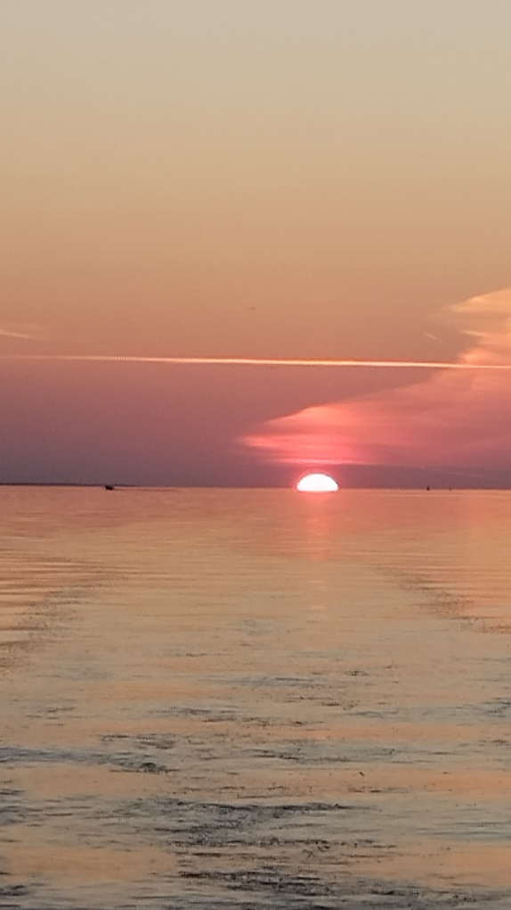

# Тур по Горьковскому морю на морской парусной яхте 

    
    

Морской простор и свежий ветер. Бег по волнам под парусом. Красивые бухты и песчаные пляжи. Встреча заката в море.
Вы будете наслаждаться красотой окружающей природы: зелеными холмами, крутыми берегами и уединенными пляжами. Мы сделаем остановки для купания и пикников на берегу, где сможете отдохнуть, позагорать и насладиться вкусной едой.

    
    

Желающие могут принять участие в управлении яхтой: научиться поднимать паруса, научиться настраивать их в зависимости от ветра и конечно же побыть рулевым, постоять за штурвалом настоящего морского корабля.
