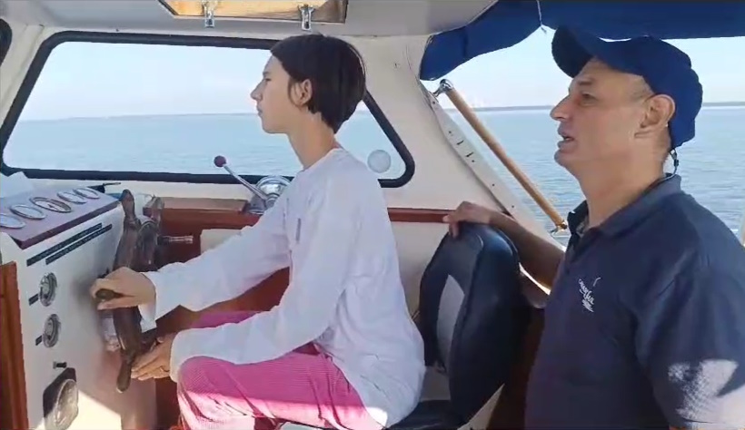
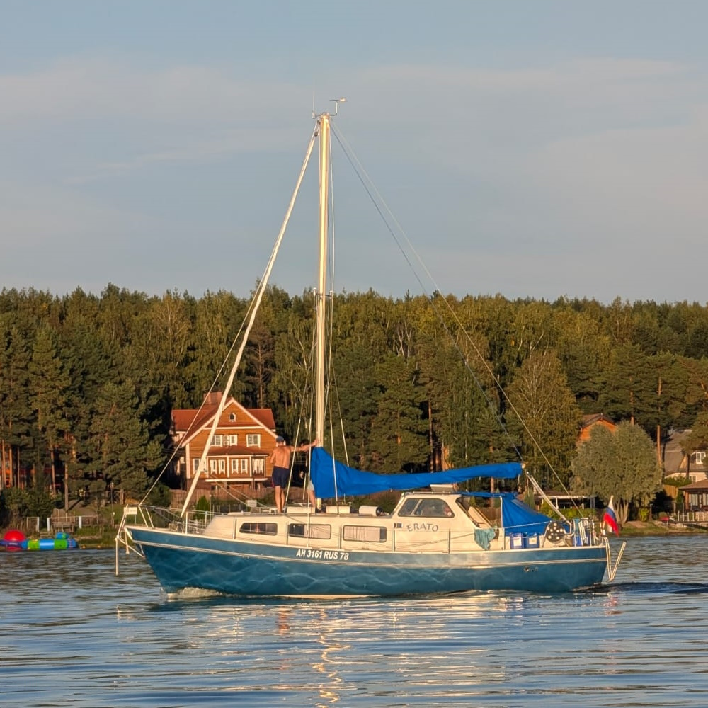
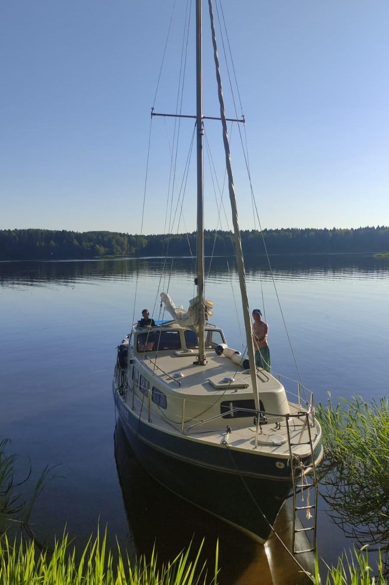
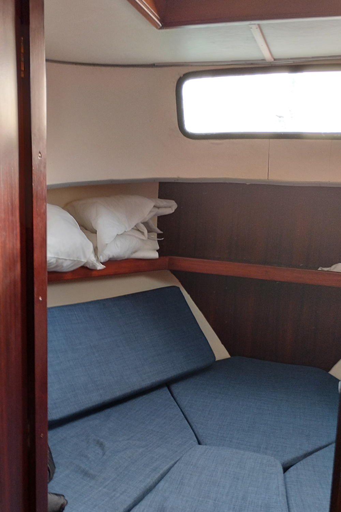

## Тур по Горьковскому морю на морской парусной яхте 

    
    

Морской простор и свежий ветер. Бег по волнам под парусом. Красивые бухты и песчаные пляжи. Встреча заката в море.
Вы будете наслаждаться красотой окружающей природы: зелеными холмами, крутыми берегами и уединенными пляжами. Мы сделаем остановки для купания и пикников на берегу, где сможете отдохнуть, позагорать и насладиться вкусной едой.

    
    

Желающие могут принять участие в управлении яхтой: научиться поднимать паруса, научиться настраивать их в зависимости от ветра и конечно же побыть рулевым, постоять за штурвалом настоящего морского корабля.

    
    

Вы узнаете про историю региона, Горьковского моря и прибрежных городов. Увидите старинные церкви и живописные деревни. Вы узнаете про передовые достижения Советского Союза в области судостроения и увидите верфь, на которой возродили строительство скоростных судов на подводных крыльях и экранопланов.

## Яхта

    
    

Наша яхта добротной финской постройки имеет просторный кокпит с защитой от дождя и солнца, шикарный полубак, на котором можно наслаждаться плеском волн, разбивающихся о форштевень, и много места на крыше рубки для принятия солнечных ванн.

    
    

    

К вашим услугам для размещения доступна двухместная носовая каюта люкс и четыре спальных места в салоне.

    
    

Яхта оборудована морским гальюном и умывальником. Есть камбуз для приготовления еды.
